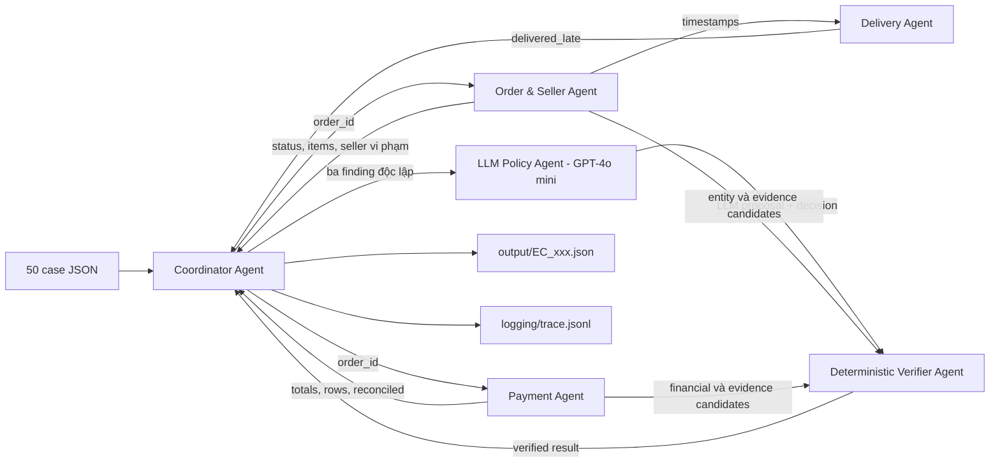

# Kiến trúc multi-agent giải quyết khiếu nại Olist

## Mục tiêu thiết kế

Pipeline triển khai `EC_POLICY_V1` bằng các agent có phạm vi dữ liệu và contract handoff riêng. Quyết định được tạo từ dữ liệu CSV có thể kiểm chứng; nội dung claim chỉ dùng để xác định order được yêu cầu, không được dùng để tạo sự kiện không tồn tại.

Model thật được khai báo cố định trong `ecommerce_disputes/settings.py`: `qwen/qwen-2.5-7b-instruct` qua OpenRouter API. Cấu hình này đáp ứng điều kiện ≤10B tham số (7 tỷ tham số) và được ghi nhận đầy đủ trong metadata/báo cáo. API key chỉ được đọc từ `.env`, không xuất hiện trong source, trace hoặc output.

## Sơ đồ agent và handoff



## Vai trò và quyền truy cập

| Thành phần | Quyền đọc | Trách nhiệm | Handoff |
| --- | --- | --- | --- |
| Coordinator Agent | Input case và kết quả từ agent | Kiểm tra policy version, điều phối theo case, ghi output sau xác minh | Gửi `claimed_order_id`; nhận finding và verified result |
| Order & Seller Agent | `olist_orders`, `olist_order_items` qua repository read-only | Trạng thái order, item/seller, phát hiện carrier nhận sau shipping limit | `OrderFinding` gồm order, items, violating items |
| Payment Agent | `olist_order_items`, `olist_order_payments` qua repository read-only | Cộng item/freight/payment bằng `Decimal`, đối soát sai số 0.10 BRL | `PaymentFinding` gồm rows, totals, `reconciled` |
| Delivery Agent | Chỉ `OrderFinding` | So sánh delivered customer date với estimated date | `DeliveryFinding.delivered_late` |
| LLM Policy Agent | Ba finding, OpenAI API; không đọc CSV và không ghi file | Gửi facts đã giới hạn cho GPT-4o mini, yêu cầu JSON và áp dụng sáu nhánh theo đúng priority | LLM proposal được đối chiếu với `Decision` chuẩn |
| Verifier Agent | Finding, decision và tập ID thực từ repository | Bác đề xuất LLM sai; dựng schema, kiểm money, entity/evidence và mapping issue/action | JSON đã xác minh hoặc exception; không tự sửa dữ liệu |

Repository chỉ nạp 50 order được input tham chiếu, giữ dữ liệu trong bộ nhớ và không sửa CSV. Chỉ Runner có quyền ghi `output/`, `logging/` và file zip.

## Luồng xử lý một case

1. Coordinator kiểm tra `case_id`, `claimed_order_id` và `EC_POLICY_V1`.
2. Order & Seller Agent và Payment Agent phân tích độc lập theo `order_id`.
3. Delivery Agent nhận timestamp đã chuẩn hóa từ Order Finding.
4. Policy Agent gọi model thật với JSON facts và yêu cầu chọn một trong sáu issue theo đúng priority. Rule evaluator độc lập tính expected decision; proposal sai bị reject thay vì fallback âm thầm.
5. Verifier dựng entity/evidence ID trực tiếp từ row thật, tái kiểm tra tiền và các giới hạn schema.
6. Coordinator chỉ ghi JSON sau khi verifier pass. Mỗi handoff được ghi thành một JSON line; `trace.jsonl` luôn bị truncate ở đầu lượt chạy.

## Tính đúng và khả năng tái lập

- Tiền dùng `Decimal` và làm tròn half-up 2 chữ số; không dùng binary float khi tính.
- Timestamp dùng nguyên giá trị CSV, không chuyển múi giờ.
- Order không có item trả về entity item/seller rỗng và item/freight bằng `0.0`.
- Evidence chỉ thuộc năm format cho phép và phải tồn tại trong tập row đã nạp.
- Model chỉ nhận facts tối thiểu, temperature 0 và JSON mode. API có retry hữu hạn; lỗi API làm batch fail thay vì giả vờ đã dùng LLM.
- `verify_outputs.py` tái chạy phần tính toán/verifier offline rồi so sánh toàn bộ JSON đã lưu, không phát sinh thêm chi phí API.
- `output.zip` được tạo bằng danh sách cố định `output/EC_001.json` đến `output/EC_050.json`, không đưa source, log hay file lạ vào gói nộp.

## Cấu trúc mã nguồn

```text
ecommerce_disputes/
  agents.py       # agent phân tích và LLM Policy Agent
  coordinator.py  # orchestration và handoff
  models.py       # contract dữ liệu bất biến, Decimal/timestamp
  llm.py          # OpenAI JSON Chat Completions client
  repository.py   # CSV read-only, order-scoped
  runner.py       # batch 50 case, metadata và zip
  tracing.py      # trace JSONL lượt chạy mới nhất
  verifier.py     # schema, evidence và financial gates
run_pipeline.py   # CLI chính
verify_outputs.py # tái tính và kiểm tra artifact
tests/            # unit test sáu nhánh và thứ tự ưu tiên
```
